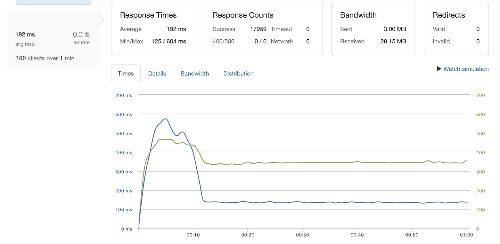
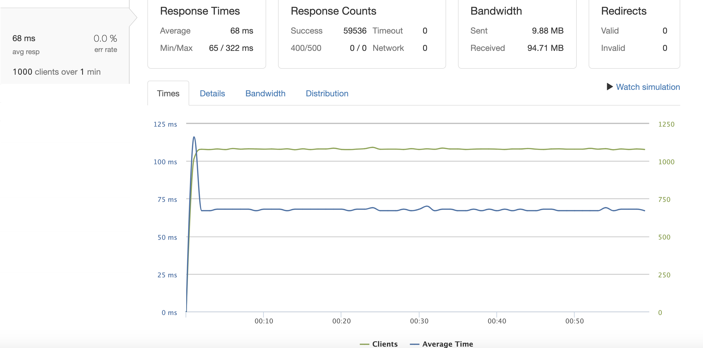

# Calendar microservice system design and backend implementation
## Table of Contents

  - [Table of Contents](#table-of-contents)
  - [Description](#description)
  - [Screenshots](#screenshots)
  - [Installation](#installation)
  - [Server API](#server-api)
  - [GitHub Gists](#github-gists)
  - [Related Projects](#related-projects)
  - [License](#license)


## Description
New system design and backend implementation of availability calendar microservice for booking hotel rooms, that helps users to check available dates, compare prices from third party booking services and find hot deals.

Main steps and goals:
- generation of >= 100 millions lines of mock data
- Optimization, benchmarking and stress testing of several relational and non-relational databases with Artillery to ensure the appropriate choice of DBMS for certain use-case.
- Seeding of chosen database
- Refactoring and extending api endpoints to support all CRUD operations, rebuilding overall server logic
- Implementing NGINX proxy-server
- Deploying services to several Amazon EC2 instances(T2.micro-1Gb) without using prebuilt AMIs
- Horizontal scaling and optimization of deployed microservice
- Creating NGINX load-balancer and reverse proxy-server
- Stress-testing with Loader.io, analyzing metrics with New Relic to uncover performance issues and define system bottlenecks
- Further optimization to ensure handling of at least 1000 requests per second with 0% error rate and response time below 100ms

## Screenshots

### Data generation and seeding
<p float="left">
  
  
</p>

### Load test results before scaling and optimization (300rps / 192ms):
<p float="left">
  
</p>

### Horizontal scaling. List of all AWS EC2 instances:
<p float="left">
  
</p>

### Nginx Load-balancer:
<p float="left">
  
  
</p>

### Nginx proxy and reverse-proxy:
<p float="left">
  
  
</p>

### Load test results after scaling and optimization (1000rps / 68ms):
<p float="left">
  
</p>

## Installation

1. clone this repository:

    ```
    git clone https://github.com/ozzychel/SDP-calendar
    ```

2. go to /calendar folder:

    ```
    cd calendar
    ```

3. install dependencies:

    ```
    npm install
    ```

4. generate mock data:

    ```
    npm run mock-data
    ```

5. seed postgres with mock data

    ```
    npm run db-seed
    ```

6. create webpack production build:

    ```
    npm run build
    ```

7. start app server

    ```
    npm start
    ```

## Server API
### Get hotel rates for certain date
- GET  `/api/calendar/hotel/:hotelId`
#### Path parameters
- hotelId: integer
#### Query string
- check_in: string
- check_out: string

#### Success status code:
* `200`
#### Returns JSON:
  ```javascript
  [{
    "hotel_id": integer,
    "rooms_total": integer,
    "title": string,
    "zip_code": string,
    "address": string,
    "url": string,
    "rating": float,
    "reviews_total": integer,
    "prices":
      {
        "rate_id": integer,
        "service_id": integer,
        "service_title": string,
        "room_id": integer,
        "price": integer,
        "day_date": date
      },
      {
        "rate_id": integer,
        "service_id": integer,
        "service_title": string,
        "room_id": integer,
        "price": integer,
        "day_date": date
      },
      ...
  }]
  ```
#### Error status code:
* `400`

### Get updated rates according to user configuration
- GET  `/api/calendar/hotel/:hotelId/update`
#### Path parameters
- hotelId: integer
#### Query string
- check_in: string
- check_out: string
- adultsNumber: integer
- childrenNumber: integer
- guestsNumber: integer
- roomsNumber: integer

#### Success status code:
* `200`
#### Returns JSON:
  ```javascript
  [{
    "hotel_id": integer,
    "rooms_total": integer,
    "title": string,
    "zip_code": string,
    "address": string,
    "url": string,
    "rating": float,
    "reviews_total": integer,
    "prices":
      {
        "rate_id": integer,
        "service_id": integer,
        "service_title": string,
        "room_id": integer,
        "price": integer,
        "day_date": date
      },
      {
        "rate_id": integer,
        "service_id": integer,
        "service_title": string,
        "room_id": integer,
        "price": integer,
        "day_date": date
      },
      ...
  }]
  ```
#### Error status code:
* `400`

### Create new booking
- POST  `/api/calendar/hotel/:hotelId/book`
#### Path parameters
- hotelId: integer
#### Query string
- guest_id: integer
- room_id: integer
- check_in: string
- check_out: string

#### Succes status code:
* `200`
#### Error status code:
* `400`

### Delete existing booking
- DELETE `/api/calendar/hotel/:hotelId/book`
#### Path parameters
- hotelId: integer
#### Query string
- rate_id: integer
- guest_id: integer
- room_id: integer
#### Succes status code:
* `200`
#### Error status code:
* `400`

## GitHub gists:

- [Postgres schema](https://gist.github.com/ozzychel/9568ac25c03d4f103520265e126c7a9f)
- [Cassandra schema](https://gist.github.com/ozzychel/ec0ab0a5b9da1fdfabbbaf01e7b02656)
- [Artillery load test config and results](https://gist.github.com/ozzychel/723a3a5e97f17cd056838ef8e37c2724)

## Related Projects

  - [Proxy](https://github.com/ozzychel/SDP-calendar-proxy)
  - [Photo-carousel](https://github.com/Hotellooo/photos-carousel)
  - [About](https://github.com/Hotellooo/about)
  - [Reviews](https://github.com/Hotellooo/reviews)

## License
[MIT](https://choosealicense.com/licenses/mit/)
