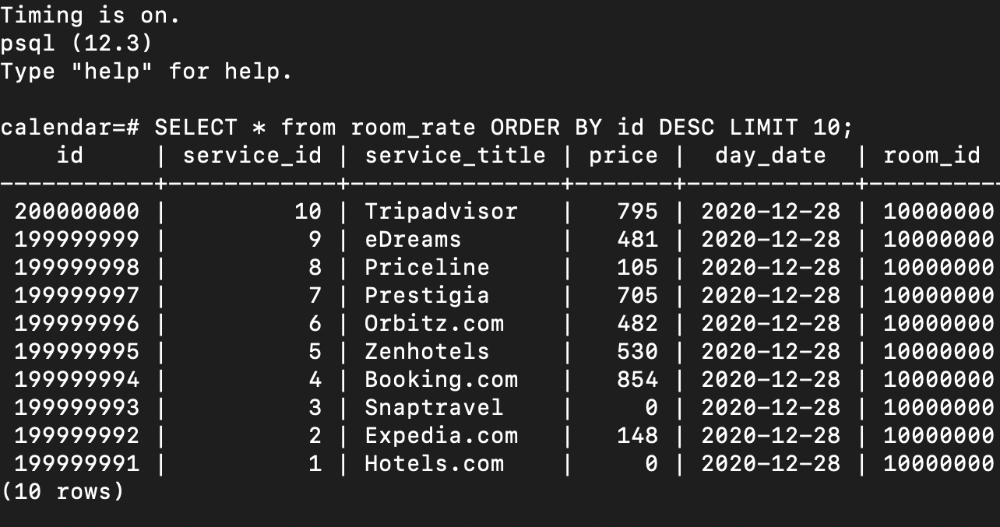

# System design of full-stack web app
## Table of Contents

  - [Table of Contents](#table-of-contents)
  - [Description](#description)
  - [Screenshots](#screenshots)
  - [Installation](#installation)
  - [Server API](#server-api)
  - [Postgres Schema](#postgres-schema)
  - [Cassandra Schema](#cassandra-schema)
  - [Related Projects](#related-projects)
  - [License](#license)


## Description
System design project on building whole new backend of a full-stack web application for booking hotels. Main goals:
- generation of >= 100 millions lines of mock data
- Optimization, benchmarking and stress testing of several relational and non-relational databases with Artillery to ensure the appropriate choice of DBMS for certain use-case.
- Seeding of chosen database
- Refactoring and extending api endpoints, rebuilding overall server logic
- Implementing a proxy-server
- Deploying services to several Amazon ec2 instances(T2.micro-1Gb) without using prebuilt AMIs
- Horizontal scaling of deployed services
- Creating NGINX load-balancer
- Stress-testing with Loader.io and analyzing metrics with New Relic to uncover performance issues and define system bottlenecks
- Further optimization to ensure handling of at least 500 requests per second with 0% error rate

## Screenshots

<!-- <p float="left">
  
  
</p>

<p float="left">
  
  
</p>

<p float="left">
  
  
</p> -->

## Installation

1. clone this repository:

    ```
    git clone https://github.com/ozzychel/SDP-calendar
    ```

2. go to /calendar folder:

    ```
    cd calendar
    ```

3. install dependencies:

    ```
    npm install
    ```

4. generate mock data:

    ```
    npm run mock-data
    ```

5. seed postgres with mock data

    ```
    npm run db-seed
    ```

6. create webpack production build:

    ```
    npm run build
    ```

7. start app server

    ```
    npm start
    ```

## Server API
### Get hotel rates for certain date
- GET  `/api/calendar/hotel/:hotelId`
#### Path parameters
- hotelId: integer
#### Query string
- check_in: string
- check_out: string

#### Success status code: `200`
#### Returns JSON:
  ```javascript
  [{
    "hotel_id": integer,
    "rooms_total": integer,
    "title": string,
    "zip_code": string,
    "address": string,
    "url": string,
    "rating": float,
    "reviews_total": integer,
    "prices":
      {
        "rate_id": integer,
        "service_id": integer,
        "service_title": string,
        "room_id": integer,
        "price": integer,
        "day_date": date
      },
      {
        "rate_id": integer,
        "service_id": integer,
        "service_title": string,
        "room_id": integer,
        "price": integer,
        "day_date": date
      },
      ...
  }]
  ```
#### Error status code: `400`
<br>

### Get updated rates according to user configuration
- GET  `/api/calendar/hotel/:hotelId/update`
#### Path parameters
- hotelId: integer
#### Query string
- check_in: string
- check_out: string
- adultsNumber: integer
- childrenNumber: integer
- guestsNumber: integer
- roomsNumber: integer

#### Success status code: `200`
#### Returns JSON:
  ```javascript
  [{
    "hotel_id": integer,
    "rooms_total": integer,
    "title": string,
    "zip_code": string,
    "address": string,
    "url": string,
    "rating": float,
    "reviews_total": integer,
    "prices":
      {
        "rate_id": integer,
        "service_id": integer,
        "service_title": string,
        "room_id": integer,
        "price": integer,
        "day_date": date
      },
      {
        "rate_id": integer,
        "service_id": integer,
        "service_title": string,
        "room_id": integer,
        "price": integer,
        "day_date": date
      },
      ...
  }]
  ```
#### Error status code: `400`
<br>

### Create new booking
- POST  `/api/calendar/hotel/:hotelId/book`
#### Path parameters
- hotelId: integer
#### Query string
- guest_id: integer
- room_id: integer
- check_in: string
- check_out: string

#### Succes status code: `200`
#### Error status code: `400`
<br>

### Delete existing booking
- DELETE `/api/calendar/hotel/:hotelId/book`
#### Path parameters
- hotelId: integer
#### Query string
- rate_id: integer
- guest_id: integer
- room_id: integer
#### Succes status code: `200`
#### Error status code: `400`

## Postgres Schema
[GitHub gist with Postgres schema](https://gist.github.com/ozzychel/9568ac25c03d4f103520265e126c7a9f.js)

## Cassandra Schema
[GitHub gist with Postgres schema](https://gist.github.com/ozzychel/ec0ab0a5b9da1fdfabbbaf01e7b02656.js)

## Related Projects

  - [Proxy](https://github.com/ozzychel/SDP-calendar-proxy)
  - [Photo-carousel](https://github.com/Hotellooo/photos-carousel)
  - [About](https://github.com/Hotellooo/about)
  - [Reviews](https://github.com/Hotellooo/reviews)

## License
[MIT](https://choosealicense.com/licenses/mit/)
